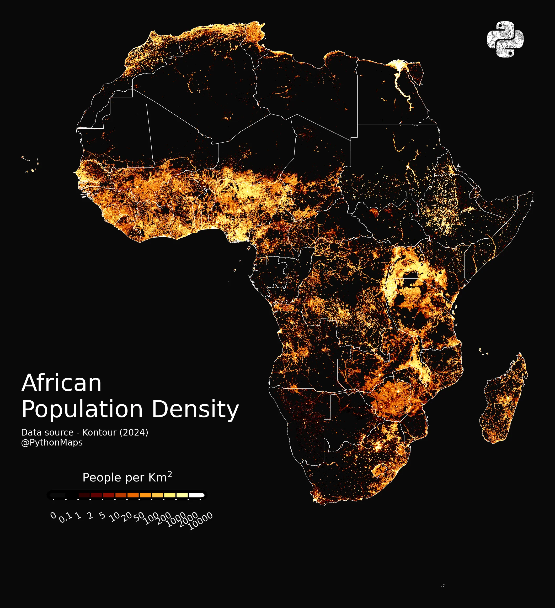

# Django-Contractor

`Personal django website`

## TODOs

- [X] Research more CMS opportunities
- [X] Create a list of pages to create
- [X] Create header
- [X] Create footer
- [X] Update colorscheme
- [ ] Create pages
- [ ] Research hosting
- [ ] Host
- [ ] Buy Domain
- [ ] Connect domain to host
- [ ] Create a simple font based logo

List of pages:

- Home page
- Services
- Thought leadership
- Schedule a call

## Content Ideas

- Image of the US or Europe w/ a black background and

